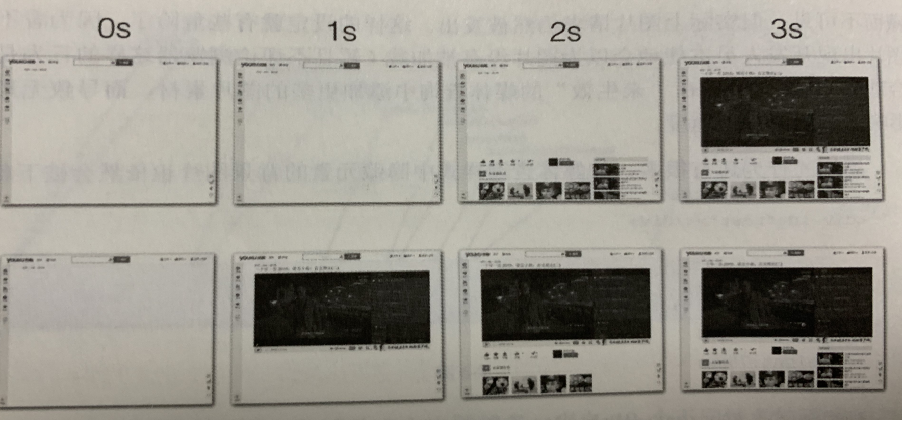
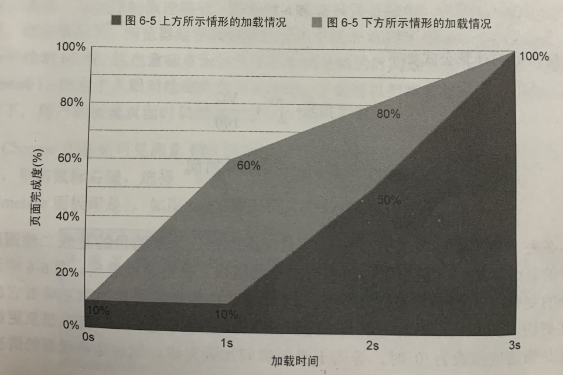

# 分享内容 前端页面加载速度指数

## 前端性能优化
    缓存技术、减少http请求（css、img、js）、CDN等等

    谷歌查看DNS缓存：chrome://net-internals/#dns
    操作系统自身的DNS缓存：ipconfig /displaydns
    hosts文件：C:\Windows\System32\drivers\etc
    浏览器就会发起一个DNS的系统调用，就会向本地配置的首选DNS服务器

## 速度指数-加载时间并非万能

### 思考：通过加载时间来衡量页面性能仍让存在局限性，考虑以下两个极端问题。

- 加载时间优化到极限后如何提升PV？
- 有没有可能A页面的加载时间慢于B页面，但A页面的转化率要好于B页面。

- 从上图可看出在相同加载时间内，下面的流程更快地显示内容，尤其是重点页面部分-对于当前这个页面最重要的是页面播放器部分。毫无疑问，更快地展现（甚至可交互的）页面内容能够提高用户停留在页面的时间。

- 从以上可得出问题二的答案。
通常页面首屏加载并呈现在浏览器视口中的内容称为“滚动之上”（above the scroll 或者above the fold）。那么很明显，更快的加载滚动之上对吸引用户更有利，甚至无需考虑整张页面的加载速度。

- 因此，加载时间并不是万能的。它无法来衡量网页加载时的用户体验。此时引入了一个指数——速度指数。

- 横轴为加载时间，纵轴为滚动之上的页面完成度，将页面加载进程绘制为一个二维面积图，速度指数就是指绘制的带底色部分面即以外的面积大小。

- 速度指数计算公式如下
- 速度指数=∫0end 1-（VC/100）
- end=以秒为单位的结束时间。
- VC=页面完成度
