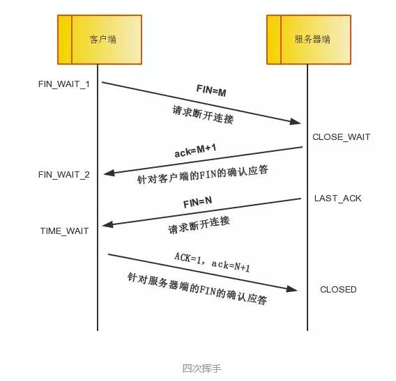

# 一次完整的HTTP请求发生了什么
## 概述
- 1、浏览器进行DNS域名解析，得到响应的IP地址。
- 2、根据这个IP，找到对应的服务器建立连接（三次握手）
- 3、建立TCP连接口发起HTTP请求（一个完整的http请求报文）
- 4、服务器响应HTTP请求，浏览器得到html代码（服务器如何响应）
- 5、浏览器解析html代码，并请求html代码中的资源（如js、css、图片等）
- 6、浏览器对页面进行渲染呈现给用户
- 7、服务器关闭TCP连接（四次挥手）

### 1、浏览器进行DNS域名解析，得到响应的IP地址。
- 1、浏览器会搜索浏览器自身的DNS缓存（缓存时间比较短，大概只有1分钟，且只能容纳1000条缓存）
存疑：1000条缓存待确定。
- 2、如果浏览器自身的缓存里面没有找到，那么浏览器会搜索系统自身的DNS缓存。
- 3、如果还没有找到，那么尝试从hosts文件里面去找。
注：
    - hosts文件是一个没有扩展名的系统文件，其作用就是将一些常用的网址域名与其对应的IP地址建立一个关联“数据库”，当用户在浏览器中输入一个需要登录的网址时，系统会首先自动从Hosts文件中寻找对应的IP地址，一旦找到，系统会立即打开对应网页，如果没有找到，则系统会再将网址提交DNS域名解析服务器进行IP地址的解析。
    - window一般位于C:\WINDOWS\system32\drivers\etc。ubuntu/mac位于/etc
- 4、在前面三个过程都没有找到的情况下，浏览器就会发起一个DNS的系统调用，就会向本地配置的首选DNS服务器（一般是运营商提供的，也可以使用Goole提供的DNS服务器）发起域名解析请求（通过UDP协议向DNS的53端口发起请求，这个请求是递归的请求，也就是运营商的DNS服务器必须提供给我们该域名的IP地址）

### 2、TCP三次握手
三次握手完成之后这个TCP连接就进入Established状态，就可以发起http请求了。
#### TCP为什么需要3次握手？
2个计算机通信是靠协议（目前流行的TCP/IP协议）来实现，三次握手是为了防止当已失效的连接请求报文段突然又传到服务端，造成双方的不一致，导致资源的浪费。

注：TCP/IP不是一个协议，而是一系列协议的总和。

#### 为什么HTTP协议要基于TCP来实现？
目前在internet中所有的传输都是通过TCP/IP进行的，HTTP协议作为TCP/IP模型中应用层的协议也不例外，TCP是一个端到端的可靠的面向连接的协议，所以HTTP基于传输层TCP协议不用担心数据的传输的各种问题。

### 3、发起HTTP请求
HTTP是一个客户端和服务器端请求和应答的标准（TCP）。客户端是终端用户，服务器端是网站。通过使用Web浏览器、网络爬虫或者其它的工具，客户端发起一个到服务器上指定端口（默认端口为80）的HTTP请求。

通俗来讲，他就是计算机通过网络进行通信的规则，是一个基于请求与响应，无状态的，应用层的协议，常基于TCP/IP协议传输数据。目前任何终端（手机，笔记本电脑。。）之间进行任何一种通信都必须按照Http协议进行，否则无法连接。

### 4、服务器响应HTTP请求

### 5、浏览器解析
浏览器拿到index.html文件后，就开始解析其中的html代码，遇到js/css/image等静态资源时，就向服务器端去请求下载（会使用多线程下载，每个浏览器的线程数不一样），这个时候就用上keep-alive特性了，建立一次HTTP连接，可以请求多个资源，下载资源的顺序就是按照代码里的顺序，但是由于每个资源大小不一样，而浏览器又多线程请求请求资源，所以从下图看出，这里显示的顺序并不一定是代码里面的顺序。

浏览器在请求静态资源时（在未过期的情况下），向服务器端发起一个http请求（询问自从上一次修改时间到现在有没有对资源进行修改），如果服务器端返回304状态码（告诉浏览器服务器端没有修改），那么浏览器会直接读取本地的该资源的缓存文件。

### 6、浏览器进行页面渲染

浏览器利用自己内部的工作机制，把请求的静态资源和html代码进行渲染，渲染之后呈现给用户，浏览器是一个边解析边渲染的过程。

首先浏览器解析HTML文件构建DOM树，然后解析CSS文件构建渲染树，等到渲染树构建完成后，浏览器开始布局渲染树并将其绘制到屏幕上。

这个过程比较复杂，涉及到两个概念: reflow(回流)和repain(重绘)。DOM节点中的各个元素都是以盒模型的形式存在，这些都需要浏览器去计算其位置和大小等，这个过程称为relow;当盒模型的位置,大小以及其他属性，如颜色,字体,等确定下来之后，浏览器便开始绘制内容，这个过程称为repain。

页面在首次加载时必然会经历reflow和repain。reflow和repain过程是非常消耗性能的，尤其是在移动设备上，它会破坏用户体验，有时会造成页面卡顿。所以我们应该尽可能少的减少reflow和repain。

JS的解析是由浏览器中的JS解析引擎完成的。JS是单线程运行，JS有可能修改DOM结构，意味着JS执行完成前，后续所有资源的下载是没有必要的，所以JS是单线程，会阻塞后续资源下载。

### 5、服务器关闭TCP连接
一般情况下，一旦Web服务器向浏览器发送了请求数据，它就要关闭TCP连接。
而关闭TCP连接就需要进行四次挥手了。
注：终端连接可以是客户端也可以是服务端

连接资源。

  

第一次挥手：客户端发送一个FIN=M，用来关闭客户端到服务器端的数据传送，客户端进入FIN_WAIT_1状态。意思是说"我客户端没有数据要发给你了"，但是如果你服务器端还有数据没有发送完成，则不必急着关闭连接，可以继续发送数据。

第二次挥手：服务器端收到FIN后，先发送ack=M+1，告诉客户端，你的请求我收到了，但是我还没准备好，请继续你等我的消息。这个时候客户端就进入FIN_WAIT_2 状态，继续等待服务器端的FIN报文。

第三次挥手：当服务器端确定数据已发送完成，则向客户端发送FIN=N报文，告诉客户端，好了，我这边数据发完了，准备好关闭连接了。服务器端进入LAST_ACK状态。

第四次挥手：客户端收到FIN=N报文后，就知道可以关闭连接了，但是他还是不相信网络，怕服务器端不知道要关闭，所以发送ack=N+1后进入TIME_WAIT状态，如果Server端没有收到ACK则可以重传。服务器端收到ACK后，就知道可以断开连接了。客户端等待了2MSL后依然没有收到回复，则证明服务器端已正常关闭，那好，我客户端也可以关闭连接了。最终完成了四次握手。

上面是一方主动关闭，另一方被动关闭的情况，实际中还会出现同时发起主动关闭的情况，也是通过四次握手。

#### 为什么连接的时候是三次握手，关闭的时候却是四次握手？

答：因为当Server端收到Client端的SYN连接请求报文后，可以直接发送SYN+ACK报文。其中ACK报文是用来应答的，SYN报文是用来同步的。但是关闭连接时，当Server端收到FIN报文时，很可能并不会立即关闭SOCKET，所以只能先回复一个ACK报文，告诉Client端，"你发的FIN报文我收到了"。只有等到我Server端所有的报文都发送完了，我才能发送FIN报文，因此不能一起发送。故需要四步握手。

#### 为什么TIME_WAIT状态需要经过2MSL(最大报文段生存时间)才能返回到CLOSE状态？

答：虽然按道理，四个报文都发送完毕，我们可以直接进入CLOSE状态了，但是我们必须假象网络是不可靠的，有可以最后一个ACK丢失。所以TIME_WAIT状态就是用来重发可能丢失的ACK报文。在Client发送出最后的ACK回复，但该ACK可能丢失。Server如果没有收到ACK，将不断重复发送FIN片段。所以Client不能立即关闭，它必须确认Server接收到了该ACK。Client会在发送出ACK之后进入到TIME_WAIT状态。Client会设置一个计时器，等待2MSL的时间。如果在该时间内再次收到FIN，那么Client会重发ACK并再次等待2MSL。所谓的2MSL是两倍的MSL(Maximum Segment Lifetime)。MSL指一个片段在网络中最大的存活时间，2MSL就是一个发送和一个回复所需的最大时间。如果直到2MSL，Client都没有再次收到FIN，那么Client推断ACK已经被成功接收，则结束TCP连接。

然而如果浏览器或者服务器在其头信息加入了这行代码：

Connection:keep-alive 
TCP连接在发送后将仍然保持打开状态，于是，浏览器可以继续通过相同的连接发送请求。保持连接节省了为每个请求建立新连接所需的时间，还节约了网络带宽。