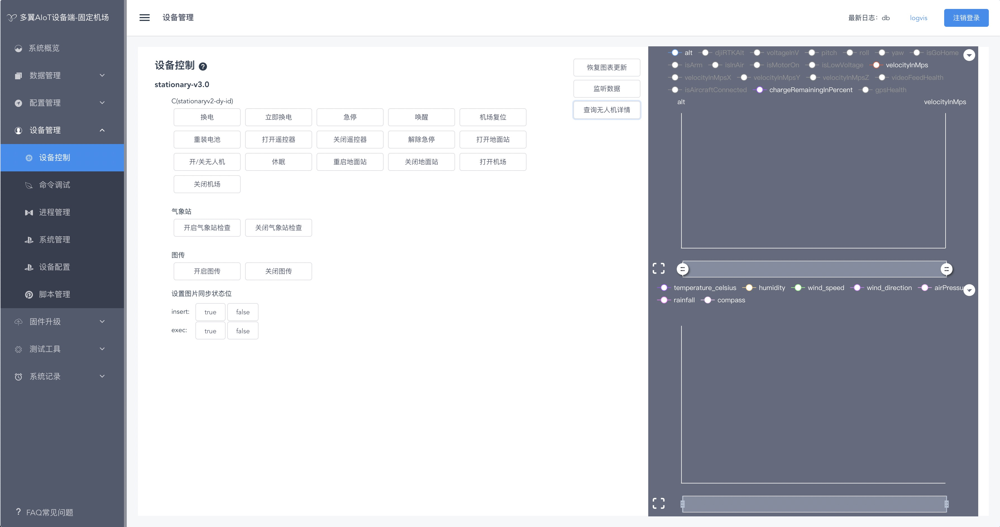
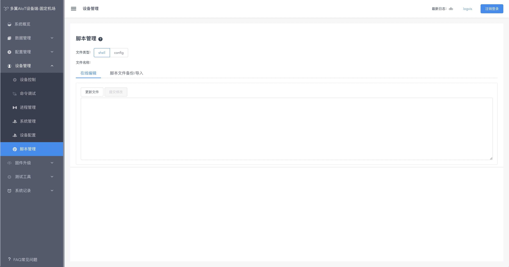

# 一、aiot运维系统（设备端）

## 1、系统概览

## 2、数据管理
### 服务器日志

### OSS日志

### 数据备份/恢复

## 3、设备管理

### a、设备控制

### b、命令调试

### c、进程管理

### d、系统管理

### e、设备配置

### f、脚本管理

## 4、配置管理

## 5、固件升级
### a、版本列表

### b、部署版本

### c、部署详情

### d、部署记录

## 6、测试工具

### a、网络测试

### b、日志分析
日志列表

配置管理

脚本库管理

脚本列表

## 7、系统记录

## 8、FAQ

# 二、aiot运维系统（中心端）

## 1、报表管理

## 2、数据中心

### 日志列表 

### 日志可视化分析 

## 3、集群中心
### a、选择集群

### b、集群管理

### c、添加管理

### d、设备列表

### d、添加设备

## 4、固件管理
### a、版本列表

### b、本地上传版本

### c、远程获取版本
